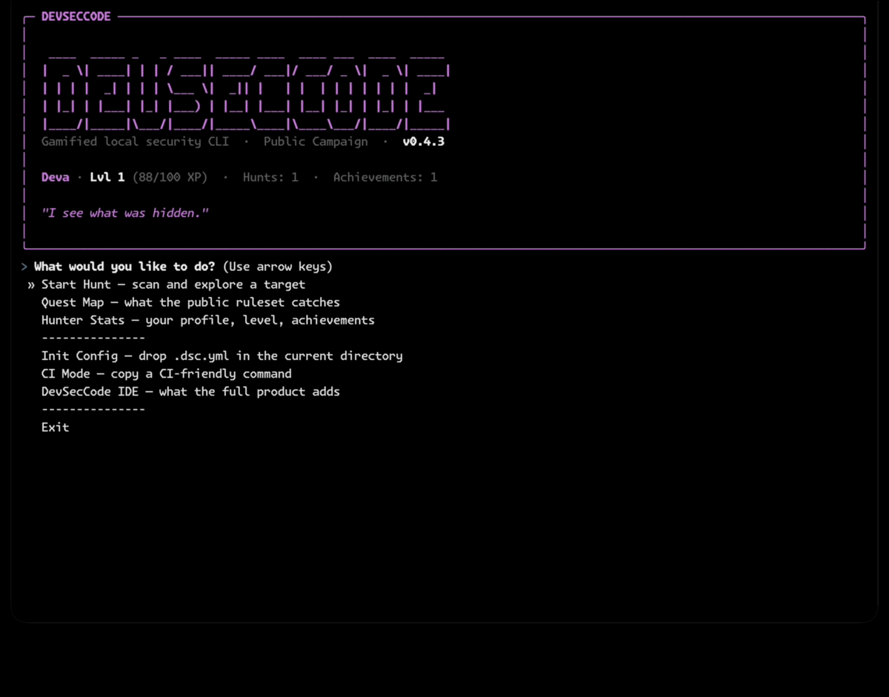

# DevSecCode Scanner

> Gamified local SAST. Find SQL injection, hardcoded secrets, XSS, and other
> CWE classics in your codebase — no SaaS dashboard, no Python toolchain, no
> CI gate required.

[](https://www.npmjs.com/package/@devseccode/scanner)
[](https://www.npmjs.com/package/@devseccode/scanner)
[](#supported-platforms)
[](./LICENSE.txt)



## Try it now

```bash
npx @devseccode/scanner hunt .
```

No install. No signup. No config file. The scanner downloads a prebuilt
~18 MB binary for your platform and runs locally — your source code never
leaves the machine.

## What it does

- **High-precision SAST rules** across 9 CWE families — SQL injection,
  XSS, command injection, path traversal, hardcoded secrets, broken
  crypto, cleartext HTTP, XXE, and CSRF — for Python, JavaScript /
  TypeScript, Go, Java, and Rust.
- **Infrastructure scanning** for Dockerfiles and Kubernetes manifests.
- **Gamified TUI** — a scan map, encounter cards, and a triage flow
  designed to be run more than once.
- **Standard outputs** — SARIF (for GitHub code scanning), JUnit (for
  CI test runners), JSON (for downstream tooling), and a colorized
  terminal report.
- **Zero runtime dependencies** — a single PyInstaller binary per
  platform. No Python install, no `node_modules` for the scanner
  itself, no internet connection at runtime.

## Install

```bash
# One-shot (recommended for first-timers):
npx @devseccode/scanner hunt .

# Global:
npm install -g @devseccode/scanner
devseccode --help                 # or `dsc` for short

# Project-local (recommended for CI):
npm install --save-dev @devseccode/scanner
npx devseccode scan . --format sarif --output devseccode.sarif
```

## Common commands

```bash
devseccode hunt .                                       # gamified scan
devseccode scan . --format sarif --output out.sarif     # CI-friendly scan
devseccode scan . --format json --output out.json       # tooling-friendly
devseccode list-rules                                   # what's in the public ruleset
devseccode explain deva.cwe-89.python-sql-injection     # rule details
devseccode init                                         # drop a .dsc.yml
```

`devseccode --help` lists every subcommand; `devseccode <subcommand>
--help` documents its flags.

## Use in GitHub Actions

```yaml
# .github/workflows/security.yml
name: Security scan
on: [push, pull_request]

permissions:
  contents: read
  security-events: write   # required for the SARIF upload below

jobs:
  scan:
    runs-on: ubuntu-latest
    steps:
      - uses: actions/checkout@v4
      - run: npx @devseccode/scanner scan . --format sarif --output results.sarif
      - uses: github/codeql-action/upload-sarif@v3
        if: always()
        with:
          sarif_file: results.sarif
```

The SARIF output lights up GitHub's native **Security** tab — the same
place CodeQL findings appear.

## Supported platforms

| Platform                              | Status                                  |
| ------------------------------------- | --------------------------------------- |
| macOS Apple Silicon (`darwin-arm64`)  | Built, code-signed, and notarized       |
| Linux x64                             | Built (glibc; not Alpine / musl)        |
| Linux arm64                           | Built (glibc; not Alpine / musl)        |
| Windows x64                           | Built                                   |
| Intel Mac (`darwin-x64`)              | Not in this release — GitHub retired the macos-13 runner pool |

For Alpine / musl Linux, run from a Debian or Ubuntu sidecar in CI.

## Privacy

The scanner is **fully local**. There is no telemetry, no analytics, no
code upload, and no network call after `npm install` completes. You can
verify with `tcpdump`, Little Snitch, or a sandboxed firewall.

## The DevSecCode IDE

The npm scanner is intentionally focused — it ships a curated rule
subset and basic outputs as a free, frictionless entry point. The
full **DevSecCode IDE** keeps the complete rule library, compliance
mapping (NIST 800-53, HIPAA, FedRAMP, SOC 2, ISO 27001, PCI DSS, and
more), SBOM and dependency CVE enrichment, audit-grade signed
evidence packages, POA&M generation, git-history credential
scanning, and guided remediation workflows.

→ [devseccode.com](https://devseccode.com)

## Project layout

```
engine/                Python source compiled to a single binary by PyInstaller
  public_rulepacks/    Curated OpenGrep .yml rules bundled into the binary
  vendor/opengrep/     OpenGrep binary fetched at build time
  dsc-cli.spec         PyInstaller spec consumed by build-binary.sh
npm-dist/              npm packaging — parent shim + per-platform packages
  packages/scanner/    Parent package (@devseccode/scanner)
  packages/scanner-*/  Per-platform binary packages
  scripts/             Build, sign, assemble, publish helpers
.github/workflows/     Tag-driven release pipeline (release-npm.yml)
resources/sample-vulns/ Tiny fixtures the test scripts scan as a smoke check
```

## Contributing

Bug reports and feature requests are welcome — see [CONTRIBUTING.md](./CONTRIBUTING.md).
Code PRs are not accepted under the current license; the same document
explains why.

## License

Proprietary — All Rights Reserved. See [LICENSE.txt](./LICENSE.txt) for
the full End User License Agreement. The scanner is free to use locally
for your internal business purposes; redistribution, modification, and
use to build a competing product are not permitted.
